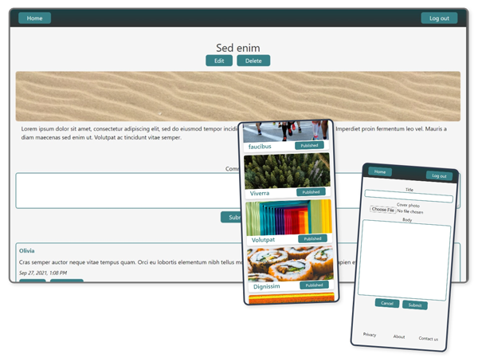

# blog-api-admin-view

The admin frontend side of a blog.

    

## Features

- Uses React.
- Communicates with the server via REST API.
- Allows admins to create, edit, and delete posts, as well as edit and delete comments. They can also publish and unpublish posts, to display and hide them from the clients frontend.
- Responsive UI built with Tailwind CSS.

## Client frontend:

- Demo: https://cameronstamant.github.io/blog-api-client/#/
- Repo: https://github.com/CameronStAmant/blog-api-client

## Admin frontend:

- Demo: https://cameronstamant.github.io/blog-api-admin-view/#/
- Repo: https://github.com/CameronStAmant/blog-api-admin-view

## Server:

- Repo: https://github.com/CameronStAmant/blog-api-server

## Normal user:

- Username: user1
- Password: user1

## Admin:

- Username: admin
- Password: admin
